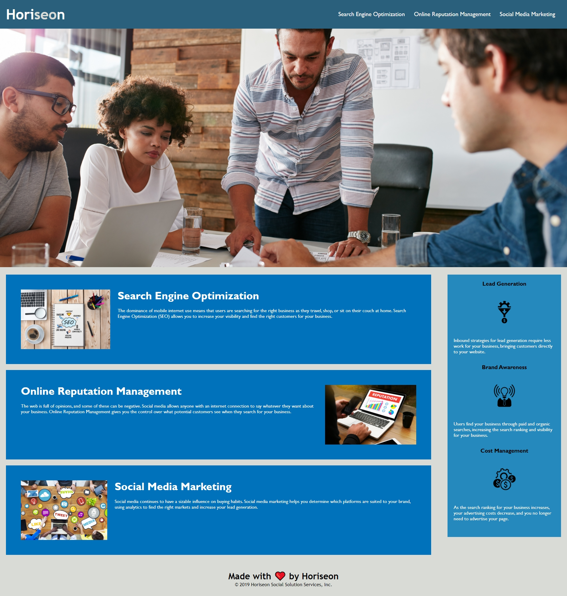

## Horiseon SEO Accesibility Proyect
This is the README.md for the Horiseon Seo Accesibility Proyect

# Description 

- Following Scout rules, I compressed the HTML and CSS files to shorten the code.
- By removing multiple div and classes and replacing them with better semantic tags, it made the webpage more accessible for those.
- In the CSS and HTML file I commented out any changes made to the code for futures developers understand.

## Links

 - [Link to Github Profile](https://github.com/Lauracejas)

 - [Link to deployed website](git@github.com:Lauracejas/horiseon-laurac-ass1.git)

## Screenshot of Website

